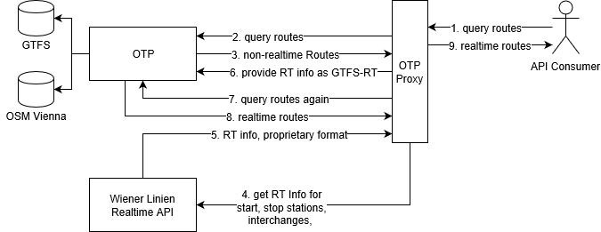

# A real-time enabled Vienna public transport router
In the following I explain my findings when I combined [OpenTripPlanner](https://github.com/opentripplanner/OpenTripPlanner) with data from [OpenStreetMap](https://openstreetmap.org/), the [Wiener Linien Timetable](https://www.data.gv.at/katalog/dataset/wiener-linien-fahrplandaten-gtfs-wien) in [GTFS](https://developers.google.com/transit/gtfs/)-format and the [Wiener Linien Realtime Data](https://www.data.gv.at/katalog/dataset/stadt-wien_wienerlinienechtzeitdaten) API to create a realtime enabled public transport router for Vienna.
Briefly  I set up an OpenTripPlanner instance and provide a small service wich consumes the Wiener Linien Realtime API and provides it in [GTFS](https://developers.google.com/transit/gtfs-realtime/)-RT format to OTP.

## Motivation
For my time-assistant/smartwatch project [digit](https://github.com/tuwrraphael/digit-service) I needed a routing component. During prototyping I used the [Google Maps](https://cloud.google.com/maps-platform/?hl=en) API, but I chose to host my own router for the following reasons:
- Google Maps does not incorporate realtime data of Wiener Linien. This is mainly because they only accept the realtime data in the [GTFS-RT](https://developers.google.com/transit/gtfs-realtime/) format. Wiener Linien provides currently just the static GTFS data as also stated in this [article](https://derstandard.at/2000063018441/Wiener-Linien-bei-Google-Keine-Echtzeitdaten-und-andere-Baustellen).
- No realtime data during route-planning in official apps. I must admit that I have no proof for that, but I planned some routes using [Quando](https://play.google.com/store/apps/details?id=com.fluidtime.qando) and [Wien Mobil](https://play.google.com/store/apps/details?id=at.wienerlinien.wienmobillab). I found that, while both apps provide a real time station departure monitor, the stoptimes in routes are different from them.
- Poor documentation and configurability of the [Wiener Linien provided routing service](https://www.data.gv.at/katalog/dataset/stadt-wien_wienerlinienroutingservice). It often offers lazy routes (with less walking distance, but there would exist a faster route departing from a more far away station), has a poor default walking speed and is very picky with the coordinates (sometimes simply finds no routes). Also a combination of using this API together with [OpenRouteService](https://openrouteservice.org/) for the walking parts was unsuccessful because the Wiener Linien API was unhappy when I sent 25 planning requests at once (routes between the 5 nearest stops to start and destination).
- It is better to bind my open source project to other open source software as to a closed API.
- OTP also provides multimodal planning (bike & public transport was most interesting for me), configurable walking/biking speeds, preferred routes, and a large community developing it.
- None of the APIs I found provided the feature to subscribe to a planned route via webhook and get alerts when stop times change.
## Approach
The Wiener Linien Realtime API allows to query realtime data per platform. There are nearly 6000 platforms featuring realtime information (altough some of them share a realtime id). It became clear that I can't torture the API with that many *requests per minute* (I assume this as an acceptable update rate). So I decided to implement a service which will query and feed the data of the *platforms which are interesting to the consumers* of my router at the moment to the OTP instance.

The following diagram gives an overview of the system.

The following steps were taken to setup the system:
1. Deploy an OTP instance with vienna data (Basically I followed this [tutorial](http://docs.opentripplanner.org/en/latest/Basic-Tutorial/), but of course using the Wiener Linien GTFS data and an OSM Vienna extract)
2. [Apply for a Wiener Linien Realtime API Key](https://go.gv.at/l9ogdechtzeitdatenwienerlinienkeyanforderung)
3. Configure the OTP router to receive GTFS-RT updates via websocket.

If your OTP instance is working, but running with the `--inMemory` switch like in the tutorial, you should persist the generated graph first - omit the `--inMemory` when starting OTP with the `--build` command and you get a *Graph.obj* file.
You should now create a directory structure like that:
~~~
otp/
otp/graphs
otp/graphs/wien
otp/graphs/wien/Graph.obj
otp/graphs/wien/wien.osm.pbf
otp/graphs/wien/wienerlinien.gtfs.zip
otp/graphs/wien/router-config.json
~~~
The router-config.json points to the websockert host/port providing the GTFS-RT:
~~~json
{
    "updaters": [
        {
            "type": "websocket-gtfs-rt-updater",
            "feedId" : 1,
            "url": "ws://localhost:3003"
        }
    ]
}
~~~
## OTP Proxy
TODO describe